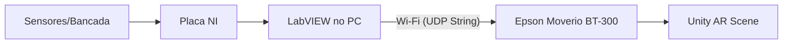

# 👓 Documentação do Projeto: Monitoramento de Dados em AR com Moverio BT-300

## 1. Visão Geral
Este projeto foca no desenvolvimento de uma aplicação de **Realidade Aumentada (AR)** para os óculos **Epson Moverio BT-300**. O objetivo principal é a visualização em tempo real de dados de tensão e corrente adquiridos via hardware da **National Instruments (NI)** e processados via **LabVIEW**, permitindo o monitoramento de máquinas de forma interativa através de marcadores (QR Codes).

## 2. Estado Atual do Projeto
O projeto conta com a infraestrutura de hardware validada e a comunicação de rede em tempo real testada com sucesso.

### Hardware & Condicionamento de Sinal
* **Placa de Leitura:** Circuito impresso de condicionamento de sinal projetado e montado para leitura e isolamento das variáveis de tensão e corrente da bancada, garantindo a proteção das entradas analógicas da placa NI USB-6212.

### Protocolo de Comunicação & Rede (UDP)
* **LabVIEW (`unity-connection-test.vi`):** VI desenvolvido para envio contínuo de pacotes via socket UDP (Porta `5005`, amostragem em 10 Hz / 100 ms).
* **Unity (`UDPDataReceiver.cs`):** Script em C# com arquitetura *multithreading* implementado no GameObject `UDP_Manager`.
* **Validação do Link:** Teste de bancada concluído. O Unity recebe e processa o fluxo contínuo de dados do LabVIEW em tempo real sem travamentos de interface.

### Estrutura de Software (Unity/Vuforia)
* **Integração AR:** O Vuforia está configurado na cena (`vuforia.unity`) realizando o rastreio (tracking) de marcadores via `ImageTargets`.
* **Scripts de Lógica (C#):**
    * `MachineData.cs`: Define a estrutura dos objetos de dados (ID, nome, limites e listas de amostras).
    * `MachineDataLoader.cs`: Carga de informações locais (`Resources/machines.json`).
    * `BaseGraph.cs`: Motor matemático para renderização de curvas de Bézier e componentes visuais do gráfico.
    * `VoltageGraph.cs` / `CurrentGraph.cs`: Renderização visual de tensão e corrente.

### Validação de Hardware
* **Plataforma de Saída:** Epson Moverio BT-300 (SO Android).
* **Estação de Trabalho:** Notebook (Desenvolvimento e Build).

## 3. Atividades em Execução
O foco atual é a migração da arquitetura de dados estáticos para um sistema dinâmico.

* **Otimização de UI:** Ajuste de transparência (Alpha) e escala dos painéis para garantir legibilidade nas lentes transparentes do óculos sem obstruir a visão do mundo real.
* **Implementação de Rede:** Criação do script de recepção via protocolo **UDP** no Unity para permitir a entrada de dados via rede Wi-Fi.
* **Lógica de Osciloscópio:** Adaptação do `BaseGraph` para suportar atualização contínua de pontos (FIFO - First-In, First-Out).

## 4. Cronograma de Próximos Passos

### Fase 1: Integração LabVIEW (Gateway)
* Desenvolvimento do VI no LabVIEW para leitura dos canais analógicos da placa NI.
* Formatação de strings JSON para transmissão via pacote UDP (Porta 5005).

### Fase 2: Sincronização e Testes
* Estabelecimento de uma taxa de atualização estável (20Hz ~ 50Hz) para manter a fluidez do gráfico sem sobrecarregar o processador do BT-300.
* Validação da precisão dos dados entre a bancada e a exibição AR.

### Fase 3: Build e Deployment
* Geração do `.apk` final e instalação no controlador do Moverio.
* Testes de campo com hardware real e marcadores fixos na máquina.

## 5. Arquitetura de Comunicação Proposta

---
## 6. Guia para Continuidade do Desenvolvimento (Handoff)

Para dar prosseguimento ao trabalho a partir do ponto atual:

1. **Formatação de Dados no LabVIEW:** Alterar o VI de produção para enviar uma string estruturada (JSON ou valores separados por vírgula) contendo múltiplos canais (`V_RMS`, `I_RMS`, `Frequência`).
2. **Parsing no Unity:** Consumir a variável `lastReceivedPacket` do `UDPDataReceiver.cs` dentro do `Update()`, aplicando `Replace(",", ".")` ou `CultureInfo.InvariantCulture` para conversão correta de decimais para `float`.
3. **Atualização de UI/Gráficos:** Repassar os valores parseados para atualizar componentes de texto (`TextMeshPro`) ou para alimentar o vetor de dados do `BaseGraph.cs`.
4. **Deploy no Moverio BT-300:** Apontar o IP de destino no LabVIEW para o IP local do óculos na mesma rede Wi-Fi e realizar a instalação do `.apk`.

### Arquivos Chave no Repositório
* `/LabVIEW/unity-connection-test.vi` — VI de envio e teste de malha UDP.
* `/UnityProject/Assets/Scripts/UDPDataReceiver.cs` — Script C# de recepção Socket UDP (*multithread*).
* `/UnityProject/Assets/Scenes/vuforia.unity` — Cena principal com marcadores e o `UDP_Manager`.
